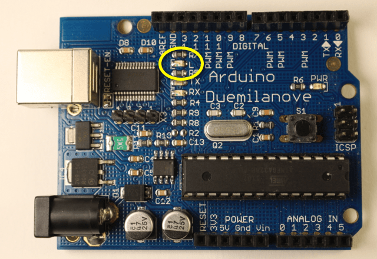

# 2.2 – BLINK
## Introduction

When you plug in a new Arduino for the first time there is a light on the board that starts to flash. The Arduino is running a program that was pre-loaded into memory. As soon as it is powered up the Arduino will run whatever program is already in it’s memory. For our first programming task we are going to change this program.
[](https://www.youtube.com/watch?v=ap8lc19qhoo&embeds_euri=http%3A%2F%2Fwww.highschoolmaker.com%2F&feature=emb_imp_woyt)
## Getting Started

Arduino programs are called Sketches. The Arduino was created to help make it easier for artists to incorporate electronics into their projects. Sketch was adopted to make the whole process less intimidating.

Sketches are written in C or C++, both are popular programming languages. Believe it or not this is fairly close to plain English. Once you start getting the hang of things this will become more evident. The Arduino software converts this into a form the Arduino board will understand and be able to execute.

Copy the code below, paste into Arduino, and upload to your board.

Here’s the complete code:

```
/*
  Blink
  Turns on an LED on for one second, then off for one second, repeatedly.
 
  This example code is in the public domain.
 */
 
// Pin 13 has an LED connected on most Arduino boards.
// give it a name:
int led = 13;

// the setup routine runs once when you press reset:
void setup() {                
  // initialize the digital pin as an output.
  pinMode(led, OUTPUT);     
}

// the loop routine runs over and over again forever:
void loop() {
  digitalWrite(led, HIGH);   // turn the LED on (HIGH is the voltage level)
  delay(1000);               // wait for a second
  digitalWrite(led, LOW);    // turn the LED off by making the voltage LOW
  delay(1000);               // wait for a second
}
```
Right now, I’m sure this doesn’t mean much to you. We will break it down a piece at a time.

## Comments

You’ll notice that there is quite a bit of grey text in the sketch. This text is completely understandable by humans, but the Arduino can’t understand it. This text is Comments. Comments are added by the programmer to explain what the various parts of the code do. It is important to include comments in your code for two very important reasons.

First, if you share your code other people will be able to understand what you did, or may even be able to learn from you. The second reason for commenting your code is so that you can remember why you did what you did. I don’t know how many times I’ve had to help a student figure out how their own code works after we get back from a long weekend or a vacation.

There are two ways for creating comments. This is an example of Block Comments:
```
/*
  Blink
  Turns on an LED on for one second, then off for one second, repeatedly.
 
  This example code is in the public domain.
 */
 ```
At the beginning there is a /* to start the block. At the end we have a */ to end the block. The Arduino will ignore everything between these marks. You can also use // to create single line comments or comments at the end of a line of code.

```digitalWrite(led, HIGH);   // turn the LED on (HIGH is the voltage level)```

Everything after the // will be ignored by your Arduino. All of the Example Sketches are well commented. This is one of the reasons they are such a good learning tool.

## Variables
The next piece is where the fun starts.
```
// Pin 13 has an LED connected on most Arduino boards.
// give it a name:
int led = 13;
```
This line of code creates a variable and assigns a value to it. led = 13 literally means make the word “led” synonymous with 13. Anytime the Arduino sees the word led it will “think” 13 instead. We could use virtually any word instead of “led” but it is usually a good idea to give variables logical names so you can remember what they are being used for later. The programmer is going to use this variable with a light emitting diode (LED) so named it accordingly.

You may have noticed that I didn’t mention the int from that line of code. This tells us what sort of variable we are creating.  int means we are creating an integer, or whole number. You can read about other variable types in the Arduino Reference, but you don’t need to know all that right now.

The end of int led = 13; is a semicolon. The semicolon ends the statement just like a period ends a sentence. In general most lines of code will end with a semicolon. Missing semicolons is by far the most common error beginning programmers make.

## Functions
In order to talk about the next block of code we need to introduce the concept of Functions. These are procedures that get run when the sketch is executed. All Arduino sketches must have setup and loop functions, even if they contain no lines of code in them.
```
// the setup routine runs once when you press reset:
void setup() {                
  // initialize the digital pin as an output.
  pinMode(led, OUTPUT);     
}
```
All of the lines of code between the curly braces, { and }, run one time when the sketch starts. So, when the sketch is first uploaded to the Arduino, when the Arduino is plugged into power, or after the rest button is pressed.

After the setup runs once the loop runs. Each line of code will be executed in the loop and when the end is reached the loop will start over again. The loop will repeat endlessly while the Arduino has power.

## Function Calls
Functions Calls

Within both the setup and loop functions are a number of other functions. The code behind these functions is hidden from our view. All we see are the function names and inputs. The function name is followed by a set of parentheses. Inside the parentheses are the function’s arguments.
```
  pinMode(led, OUTPUT);     
  ```
The function pinMode has two arguments. The first is a number that corresponds to one of the digital pins on our Arduino. You’ll notice in this case there is no number but the variable led. It is important to remember that when the Arduino “sees” led it sees the number 13. The second argument is OUTPUT. Digital pins can be inputs or outputs. When lighting up LEDs we set the pin to be an output, if we were to use a pushbutton we’d set it to an input. This line of code tells the Arduino to use pin 13 as an output pin. Since we only need to do this once we typically put this line of code in the setup function.

As it turns out, pin 13 is also tied to an LED that is mounted on the board. We’ll just look at this LED. In the next lesson we’ll learn how to add an external LED.



There are two other functions to note in this sketch, digitalWrite and delay. Like pinMode, digital Write has two arguments. The first argument is the number of one of the digital pins. The second argument must either be HIGH or LOW. If set to HIGH the pin on the Arduino will output +5 volts, when set to LOW it will act as a Ground (negative). digitalWrite(led, HIGH) will turn on the LED attached to pin 13. digitalWrite(led, LOW) will turn the LED off.

The delay function has only one argument. This is the number of milliseconds to “delay” for. So, delay(1000) means pause the sketch for one second. If you wanted half a second you’d delay for 500 milliseconds.

So the loop will:
1. Turn on the LED
2. Wait one second
3. Turn off the LED
4. Wait one second
5. Repeat
This will continue as long as the board has power.

### Now, you should play:
- Make it blink faster and/or slower
- Make the two delays last for different amounts of time
- Make it blink just barely fast enough that you can’t see the flashes. Then gently wave it back and forth (you might need to turn the lights in your room off)
