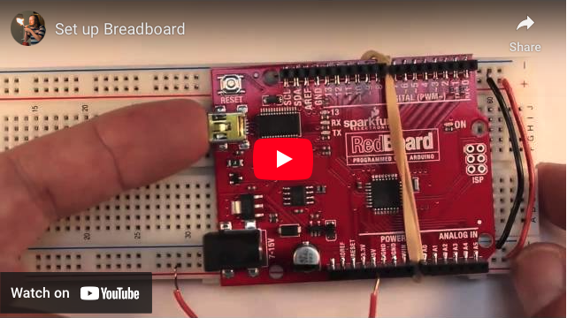
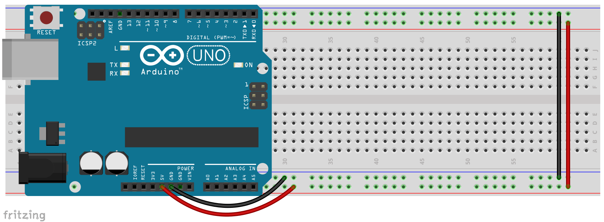
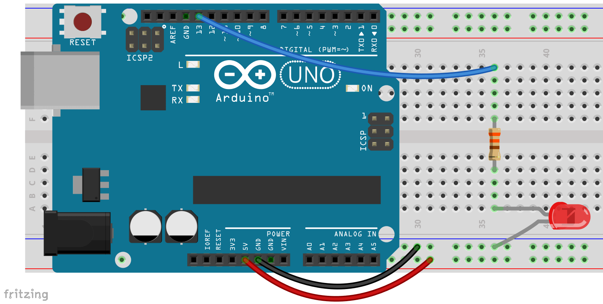

# 2.3 - Using a Breadboard with Arduino

In this lesson we will set up our breadboard for maximum utility with Arduino. Once set up you can leave it together this way for the rest of this course.

The process is pretty straight forward. With the breadboards we use in class you will attach wires to the side rails. 5V goes to the red line and Gnd goes to the blue line. Then you need a wire to connect the red rail on one side to the red on the other and another wire to connect blue to blue. Once done your breadboard is ready to go. All of the circuit pictures used in this course will assume this basic set up.

Next we’ll need to add an external LED. LEDs have two legs, on most LEDs the shorter one is the negative lead. It is also important to note that LEDs will burn out if you put too much voltage through them. So you will almost always need to include a resistor. The exact size will vary with the specific LED and the voltage we’re using. When in doubt 1k ohm is a good default. For our LEDs and Arduino 220 or 330 ohms work just fine. [Read this page](https://www.allaboutcircuits.com/textbook/reference/chpt-2/resistor-color-codes/) if you need to learn more about resistors and the resistor color code.. Now attach your resistor and LED to your Arduino, being sure that the short (negative) lead is attached to our negative power rail (or ground).

Once you have your external LED flashing add a second one on a different pin. Don’t forget to declare a new variable for your new LED and set the new pin as an output. Then add a few more. Play a little, make them flash separately, then make them flash together.
