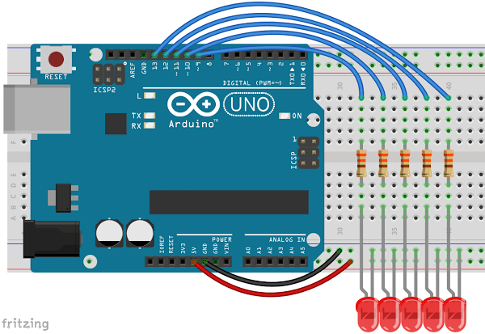
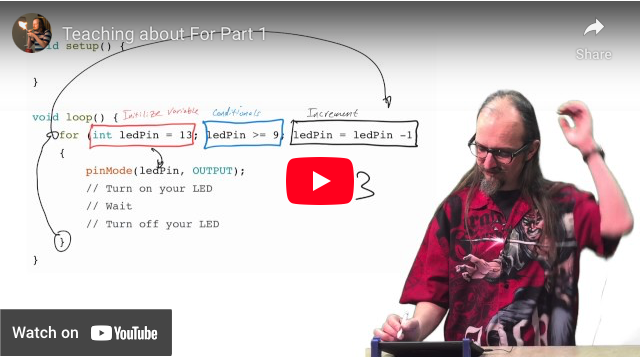
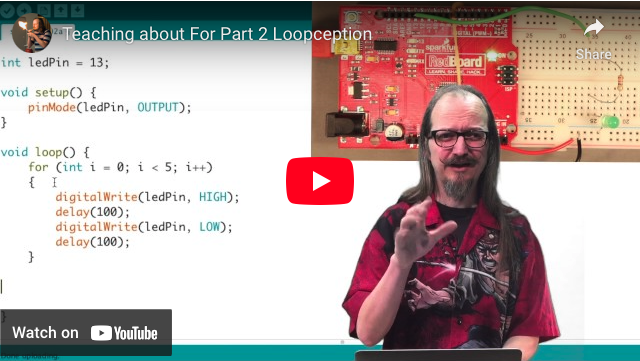

# 3.3 – SEQUENCE LEDS WITH FOR


In this lesson you’ll be learning about the “for” command. The “for” command is the next iteration of our repetition lessons. It will keep repeating what ever is in the brackets as long as the “condition” is true. You’ll need to set up your circuit so that you have an LED (with appropriate resistors) plugged into pins digital pins 9-13. Upload the following to your Adruino.
```
void setup() {
    
}

void loop() {
    for (int ledPin = 13; ledPin >= 9; ledPin = ledPin -1)
    {
        pinMode(ledPin, OUTPUT);
        // Turn on your LED
        // Wait
        // Turn off your LED
    }   
}
```
Again, the results should look very familiar. The for function above will light up each pin starting at 13 and counting down to 9 in sequence, turning it off before it lights the next one. You’ll notice int ledPin=13 in the for statement. In this case ledPin only has meaning inside the for loop, this variable is not declared at the beginning of the program.

The basic structure of “for” is as follows:
```
// for(initialization; condition; increment)
```
[](https://youtu.be/G5FJ5qo2xwA)

All for loops will have an integer variable associated with them. I chose to use ledPin as the variable name since we’ll be lighting an LED. The process runs as a loop. The condition is checked, if true the code in the brackets is run and then the expression is executed. Then it checks to see if the condition is still true. It functions just like our while loop. In this loop, is ledPin greater than or equal to 9? If true the code is run and Expression are completed. For our loop, the value of ledPin will be decreased by 1 each time through, which will cause the next LED to light up.

When ledPin is decreased to 8 the condition is no longer true and the process stops. Overall, this is very similar to how we used our while loop. As we’ve said before, there are often many ways to complete the same task. Some of these ways will work better in certain conditions than others, but often it doesn’t matter how you do it.

[](https://youtu.be/RmuPtm4Fs6g)

## One more thing, Incremental Operators

There is another, probably better way, to write the expression ledPin = ledPin – 1. We can use an incremental operators. In this case it would be ledPin––. ledPin–– means take one away from the value of ledPin.

| syntax | what it does |
| ----- | -----|
| x++	| increases the value of x by 1 |
 | x––	| decreases the value of x by 1 |
 | x += y	| also increases the value of x by y |
 | x -= y	| also decreases the value of x by y |
 | x *= y	| multiplies x by y |
| x /= y	| divides x by y |

So, if we let x=2, then x+=5 would set x to be 7. Again if we let x=2, then x*=5 would set x to be 10.

### Time to Play
- Once you’ve gotten this working see if you can add a few more leds.
- Make it go there and back again.
- Use an incremental operator to light up only every other LED.
- Challenge: Light the LEDs at both ends and have them move to the center simultaneously. Hint: Use only one For.
