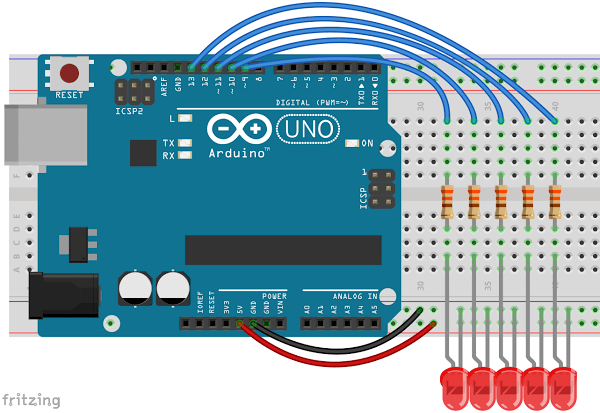

# 3.1 – SEQUENCE LEDS WITH IF


Let’s say you want to sequence LEDs, that is to say turn them on and off one after the other, but you’re lazy. You did this in an earlier lesson but your sketch had a lot of repetition. As it turns out, computers are great at repetition. They can do the same thing over and over again while each time changing one thing. Create a circuit with LEDs in pins 9-13. Don’t forget you’ll need a resistor for each LED.

In this sketch we will let our Arduino do the hard work for us. The Arduino really is a computer, so we’ll let it do some repetitive calculations. Load this sketch on your Arduino and see what happens. Hit the reset button on your board to run it again.
```
int ledPin = 13;

void setup() {
}

void loop() {
  pinMode(ledPin, OUTPUT);
  digitalWrite(ledPin, HIGH);
  delay(1000);
  digitalWrite(ledPin, LOW);
  delay(1000);
  ledPin = ledPin - 1;  
}
```
This sketch uses no new functions. Everything we’re doing here we’ve done in previous lessons. One of the reasons we use variables when we do a line of code like, digitalWrite (ledPin, HIGH); is so that we can change its value if we need to.
```
  ledPin = ledPin - 1;
  ```
This line of code does just what it appears to say. However, it can appear confusing if you think about it in the math sense, but this is not an algebraic expression. In plane english this says, “Set the new value of ledPin to be the old value of ledPin minus one.”

So with ledPin=ledPin-1 in our program the value of ledPin will decrease by one each time through the void loop(). The first time through ledPin is 13 so the LED in pin 13 will light up and then go out. We then subtract one and ledPin is given the value of 12, causing the LED in 12 to go on and then off, and so on. After a few times through it will be lower than our lowest pin and in fact will eventually be a negative number unless we do something about it!
```
int ledPin = 13;

void setup() {
}

void loop() {
  pinMode(ledPin, OUTPUT);
  digitalWrite(ledPin, HIGH);
  delay(1000);
  digitalWrite(ledPin, LOW);
  delay(1000);
  ledPin = ledPin - 1;
  if (ledPin < 9)
  {
    ledPin = 13;
  }
}
```
We’ve added a new bit here that will allow the LED sequence start over:
```
  if (ledPin < 9)
  {
    ledPin = 13;
  }
  ```
This is an “if” function. It asks the questions, is this true? In this case it is asking if ledPin is less than 9.

If the statement in parenthesis is true then the code in the curly braces is run. If the statement is false then the code in the curly braces is skipped.

You may also have noticed that the “if” line does not end in a semi-colon. This is true of any line that is immediately followed by a set of curly braces. You’ll notice neither setup nor loop are followed by semi-colons either.
[](https://youtu.be/xNfma0XAM6I)
### Other stuff to know:

We could have used this code instead
```
if (ledPin == 8)
  {
    ledPin = 13;
  }
  ```
In this case it is asking if ledPin equals 8. We must use double equal sign to ask do these two equal each other. One of the most common mistakes is to use a single equal sign here. The single equal sign will not ask the questions is ledPin equal to 8. It will instead change the value of ledPin to be 8.

## Comparison Operators

In the table below are the other comparison operators you can use with an if statement.
|syntax | What it Means |
| --- | ----------- |
 | x==y	| x is equal to y |
 | x!=y	| x is not equal to y |
 | x>y	| x is greater than y |
 | x>=y	| x is greater than or equal to y |
 | x<y	| x is less than y |
 | x<=y	| x is less than or equal to y |
 
## More Stuff

In the future, you might want to ask two questions in the same if statement. In this case you would use a Boolean Operator. So if you wanted to ask two questions and wanted both to be true you’d ask:
```
  if (a>0 && a<10)
  ```
This would be true only if a had a value between 0 and 10. You could tack on more &&’s and ask three or more questions as well. If you needed only one of the statements to be true you would use or instead of and. For or in Arduino, and many other programing languages, you use the “pipe” (shift-backslash). Just as and requires double-ampersands &&, or requires double-pipe ||:
```
  if (a>=0 || b>=0)
  ```
Would be true if either or both statements were true.You might also want to investigate else and else if. This can be another way to ask multiple questions at the same time. For more detail on this you should check out the [Arduino Reference entry on Else](https://www.arduino.cc/reference/en/language/structure/control-structure/else/).

###Time to play:
- Add a couple more LEDs and change your code to accommodate them.
- Make the sequence go in the other direction. That is to say from 9 to 13.
