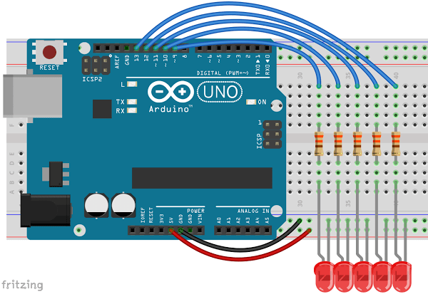

# 3.2 – SEQUENCE LEDS WITH WHILE


In programing there is almost always multiple ways to arrive at the same result. In this case we will use another function to turn on and off our LEDs one after the other. Upload the following code to your Arduino and see what it does. It should look very similar to the last lesson.
```
int ledPin = 13;

void setup() {
}

void loop() {
  while (ledPin >= 9)
  {
    pinMode (ledPin, OUTPUT);
    digitalWrite(ledPin, HIGH);   
    delay(100);               
    digitalWrite(ledPin, LOW);
    // Add in a line to decrease ledPin by 1 
  }
  ledPin = 13;     
}
```
[](https://youtu.be/NpMEPx3sPbI)

Overall, this sketch is very similar to the “If Loop” in our last lesson. It relies on a new function, however.
```
while (ledPin >= 9)
```
The argument for while is the same as for if, it’s a comparison operator. In this case the code in the curly braces will run if the statement in parenthesis is true, just like with if. After the code is run the Arduino checks again to see if the statement is still true. If it is the code will be executed again. This will continue over and over again until the statement is false. Then the program continues on. Note, whatever variable is being checked must be changed within the while otherwise once the while loop starts it will never end.

### Time to Play
- Make the sequence go in the other direction. That is to say from 9 to 13.
- Make your LEDs go there and back again (hint, you’ll need a second while).
- Challenge: Light the LEDs at both ends and have them move to the center simultaneously. (hint, this time only one while)
