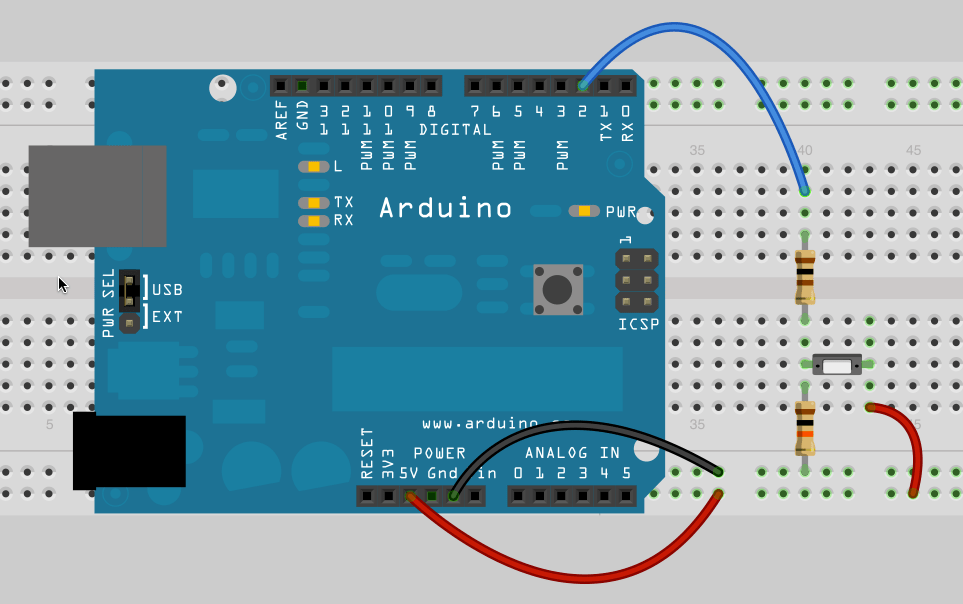

# 4.3 – Alternating Action


Let’s say we wanted to create a counter so that counts how many times we press a button. We might try the code below:
```
int buttonPin = 2;
int buttonState = 0;
int count = 0;

void setup() {
  Serial.begin(9600);
  pinMode(buttonPin, INPUT);
}

void loop() {
  delay(100);
  buttonState = digitalRead(buttonPin);
  if (buttonState == HIGH)
  {
    count = count +1;
    Serial.print("Count = ");
    Serial.println(count);
  }
  else
  {
    // Print "Waiting" to the Serial Monitor
  }
}
```
You’ll probably see that if you hold the button too long you get more than one added to your count. We could make our delay longer to try to make it easier to let go of the button before it counts again. However, this is not really a good solution.

What we really want is an alternating action switch, where the press-and-release of a button does something, not the press-and-hold. Basically we want to test whether the button was just pressed, or even just released. Try this code:
```
int buttonPin = 2;
int buttonState = 0;
int buttonPressed = 0;

void setup() {
  Serial.begin(9600);
  pinMode(buttonPin, INPUT);
}

void loop() {
  delay(100);
  // Check to see if the button is pressed here
  if (buttonState == HIGH && buttonPressed == 0)
  {
    Serial.println("Button Pressed");
    buttonPressed = 1;
  }
  if (buttonState == LOW && buttonPressed == 1)
  {
    Serial.println("Button Released");
    buttonPressed = 0;
  }
}
```
In the last section something was printed to the serial monitor every time through the loop. Now we only print when the button has just been pressed or just been released. We did this by checking two conditions at the same time. (If you need to review this go back to section 3.1 and watch the video.) We also created a new variable that changes when the button is either pressed or released.

### Tasks to Accomplish
- Actually write a program to track the number of times a button is pressed.
- Change your counting program to start at 10 and count down. When you get to zero it should print “Blast Off!!!” and then reset the counter to 10.
- Write a program to toggle on and off an LED. I press once and the LED turns on, press a second time to turn it off, press again and it turns back on, and so on.
