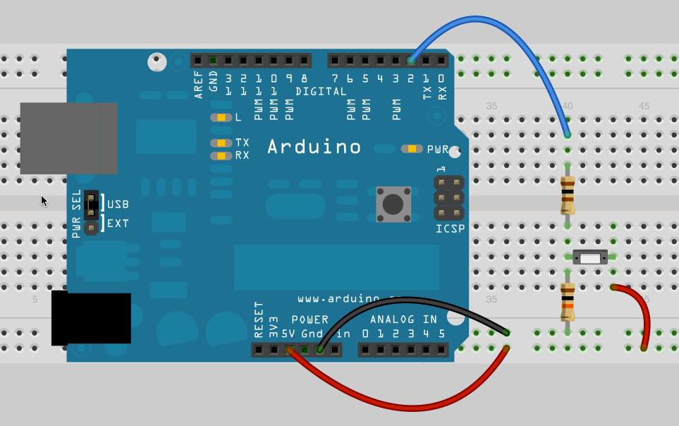

# 4.2 – DIGITAL INPUT TUTORIAL


Pins 1-13 can be used as inputs or outputs. So far we’ve only used them as outputs. You set the pin to be an input using pinMode just as we do when making a pin an output.

You will need to build the circuit shown. Pin 2 will be looking for an input of either HIGH or LOW. digitalRead looks to see whether we have positive or negative voltage on the pin of interest. This is called “reading the state of the pin”. If it is positive the state is HIGH or one, if negative it is LOW or zero. Technically you don’t need the 100 ohm resistor. It’s there to protect the Arduino chip from a short circuit.

The size of the two resistors are not critical. They are a rough guide. The 10k resistor can be as small as 4.7k and there is really no maximum, but if it is too big the results can be unpredictable. The presence of the 10K resistor is critical, it is called a pull down resistor. There are three possible states an input can be: High (positive), Low (negative), or nothing. Unfortunately, the Arduino has only two choices, High or Low. If you leave out the pull down resistor the pin can never “see” Low and the results will be totally unpredictable. It might appear to work perfectly one moment and then suddenly not work. If you were to simply put a wire in for the 10k ohm resistor then you’d cause a short circuit any time you pressed the button.

Try this code out:
```
int sensorValue;

void setup() {
  Serial.begin(9600);
  pinMode(2, INPUT);
}

void loop() {
  sensorValue = digitalRead(2);
  Serial.println(sensorValue);
  delay(100);
}
```
[](https://youtu.be/cRIQmmQJW4M)

Next try out the code below. Here we expand on the if by adding an else. Now if the if is false it will execute the code in the curly braces after the else. The else code will be skipped if the if was true.
```
int buttonPin = 2;
int buttonState = 0;

void setup() {
  Serial.begin(9600);
  pinMode(buttonPin, INPUT);
}

void loop() {
  delay(100);
  buttonState = digitalRead(buttonPin);
  if (buttonState == HIGH)
  {
    // Print "Button Pressed" to the Serial Monitor
  }
  else
  {
    // Print "Waiting" to the Serial Monitor
  }
}
```
### Time to Play
- Swap the positions of the wire and the 10k resistor attached to the push button (by this I mean plug the resistor into positive and the wire into negative). Run the program again. What do you see? Why is it different?
- Add an LED to pin 13 on your Arduino (you should know ho to do this) and modify the program so that the Arduino turns on and off the LED when the button is pressed.
- Change the program so that when the button is pushed the light turns on for 5 seconds and then shuts off.
- Build the LED sequencer you built in the last lesson. Have the leds light up one after the other and repeat and when you push the button have them reverse direction.
