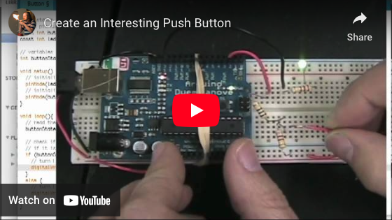

# CREATE AN INTERESTING PUSH BUTTON

You must create an “Interesting Pushbutton” and use it with your Arduino in some way. You should create/build an actual pushbutton. This is **not an assignment to come up with an interesting use of the push button I gave you.** You make in interesting push button and then use it with Arduino in some way.
