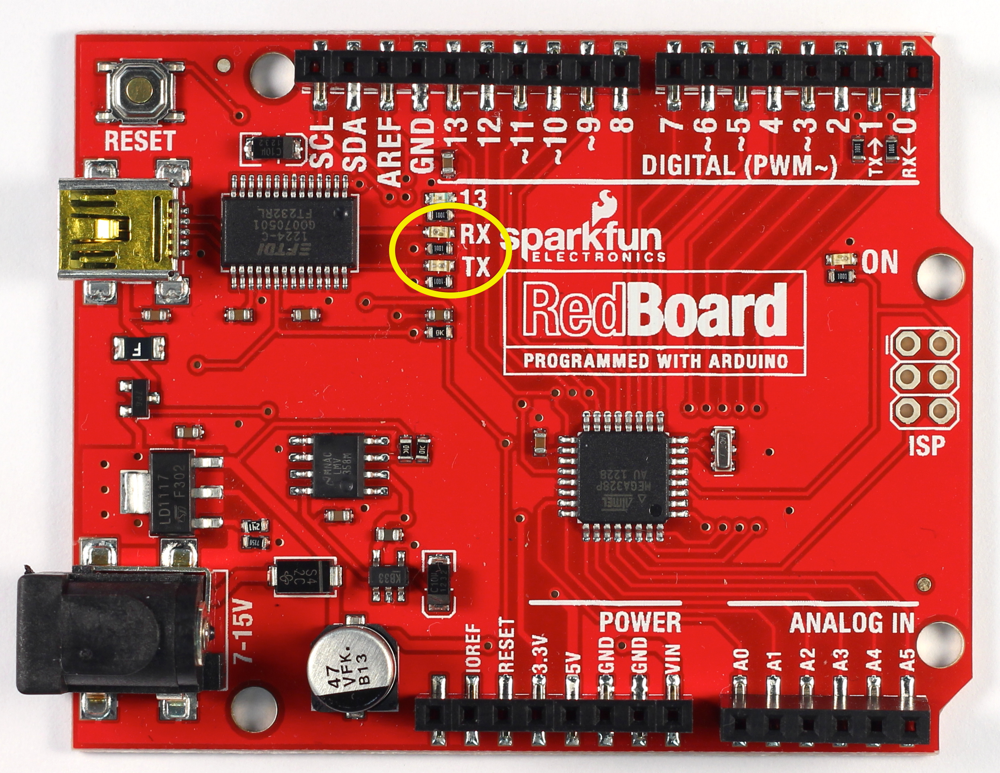
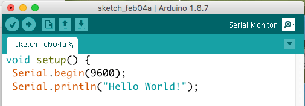

# 4.1 – INTRODUCTION TO SERIAL COMMUNICATION

In this lesson we’ll learn how to use the Serial Library to communicate from the Arduino board back to the computer over the USB port. Then we’ll learn how to program the Arduino to manipulate numbers and data.

For this lesson we won’t need the breadboard. You should leave it all set up with wires and LEDs attached, but you can disconnect it from your Arduino if you like. We’ll focus instead on the RX and TX LEDs on your Arduino.



## What is a Library?

Libraries are great places. If you ever need to learn how to do something, like say fix a motorcycle, you can go to your local library and take out a book. Sure you could buy the book but the library is nice because as a resource you can get the book whenever you need it, keeping your house uncluttered.

Software Libraries are very similar. We’ve already looked at functions and what we can do when we use them together. A library is a big collection of functions, where all the functions are related! If you, say, want to control a motor, you may want to find a Motor Control Library: a collection of functions that have already been written for you that you can use without having to do the dirty work of learning the nuances of motors.

The library we will be using is the Serial Library, which allows the Arduino to send data back to the computer.

## What is Serial?

Serial may sound like a tasty breakfast food, but that would be cereal. The word serial means “one after the other.” For example, a serial killer doesn’t stop with one murder, but stabs many people one after the other. Serial data transfer is when we transfer data one bit at a time, one right after the other.

Information is passed back & forth between the computer and Arduino by, essentially, setting a pin high or low. Just like we used that technique to turn an LED on and off, we can also send data. One side sets the pin and the other reads it. It’s a little like Morse code, where you can use dits and dahs to send messages by telegram. In this case, instead of a long cable, its only a few feet.

## Bits & Bytes

*The world isn’t run by weapons anymore, or energy, or money. It’s run by little ones and zeroes, little bits of data. It’s all just electrons. – Sneakers*

Now is a good time to review how data is measured. For example, we measure weight with “ounces” and “pounds” (or grams and kilograms) and distances with “inches,” “feet,” and “miles” (or centimeters, meters and kilometers). Information has its own system of measurements:

A single bit is either a zero or a one.
You can group bits together into 8 bits which is 1 byte.
1024 bytes (8192 bits) is one Kilobyte (sometimes written KB).
1024 KB (1048576 bytes) is one Megabyte (MB)
1024 MB is 1 Gigabyte (GB)

An interesting thing to note is while 1000 grams is a kilogram, nearly all computer systems consider 1024 bytes to be a kilobyte. That is, a 1.0 Kilobyte file on your computer is 1024 bytes. So not at all metric. the number 1024 comes from the binary numbering scheme that computers use. We’ll talk more about this in a future lesson.

## A familiar friend?

We’ve actually used the Serial communications capability already quite a bit…that’s how we send sketches to the Arduino! When you Compile/Verify what you’re really doing is turning the sketch into binary data (ones and zeros). When you Upload it to the Arduino, the bits are shoved out one at a time through the USB cable to the Arduino where they are stored in the main chip.

Next time you upload a sketch, look carefully at the two LEDs near the USB connector, they’ll blink when data is being transmitted. One blinks when the Arduino is receiving data (RX) and one blinks when the Arduino is transmitting 

## Time for our first sketch

Enough chatting amongst ourselves, its time to get the Arduino talking. Our first sketch is going to be the hello world! program. When it starts up, it will say “hello world!” “Hello World” is the first program that many people learn when programming. With Arduino, the Blink Sketch serves this function.

In the Arduino IDE, create a New Sketch… and save it as HelloWorld. Into the new sketch, copy and paste the following code, then save it.
```
void setup() {
 Serial.begin(9600);
 Serial.println("Hello World!");
}

void loop() {
}
 ```
OK first thing to notice is that there’s nothing in the loop function! We’ve gutted it…and put some stuff into the setup function.
*Even if we have nothing in the setup or loop functions, the Arduino requires them to be there. That way it knows you really mean to do nothing, as opposed to forgetting to include them!*

The first line of code in the setup function is this one:
```
Serial.begin(9600);           // set up Serial library at 9600 bps
```
We definitely see that there is a Serial thing going on, and it looks like there is a function call as well. This is a library function call. The library is called Serial and inside the library is a function called begin. This function has a single argument.

When we call a library function it will have a very specific format:
```
LibraryName.functionName(arguments)
```
If there’s no library name, it means that the function is in the ‘default’ collection of functions we use. For example, delay() is so common, the designers of the Arduino software didn’t bother putting it into a library.

So there’s some mystery function that’s called begin, well it’s not too tough to figure out what it might do. It’s the function that gets the Serial stuff ready. But what’s the 9600 about?

The comment says 9600 bps, and just so you know bps stands for bits-per-second (we will refer to this as the baud rate). If you have broadband connection, you may remember reading somewhere that it has, say 350 kbps download rate. This is how fast the connection can read and write bits on the wire. (Needless to say, your broadband connection can transfer data a lot faster than an Arduino!)

OK so Serial.begin sets up the Arduino with the transfer rate we want, in this case 9600 bits per second.

Lets move on to the next line:
```
  Serial.println("Hello world!");  // prints hello with ending line break 
  ```
This line also uses the Serial library, this time it’s calling a function called println which is just a shorthand for “print line”. Note that the 6th letter in println is the letter L not the number 1. This time the input is a quotation, the line of text we would like it to print. We use two “‘s (double quotes) to indicate the beginning and end of a line of text.

## And then…nothing???

It looks like not much is going on here. Somewhat disappointing since we had so much fun with blinking colored lights before. The trick here is that while you can see blinking lights quite easily, seeing serial data requires a monitor, which like your display monitor will show us what data is being transferred.

Lucky for us, there’s a serial monitor built into the Arduino software!



When you click Serial Monitor (top right corner of Arduino IDE) a new window will open and your Arduino should reset. Your text will now appear in the Serial Monitor. You can make it print again my pressing the reset button on your Arduino.

## Time to Play

- Change the text
- Remove the “ln” from your Serial.println and re-run your code. Be sure to hit the reset button several times.
- Add a second line of text.
- Remove the serial print from setup and put it in loop. Be sure to include a short delay.

The text and code examples above were copied and slightly modified from Arduino tutorials by Limor Fried at http://www.ladyada.net/learn/arduino under http://creativecommons.org/licenses/by-sa/2.5/ as such, this page is subject to the same license.
