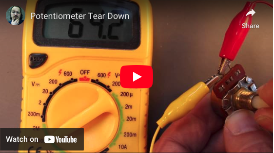
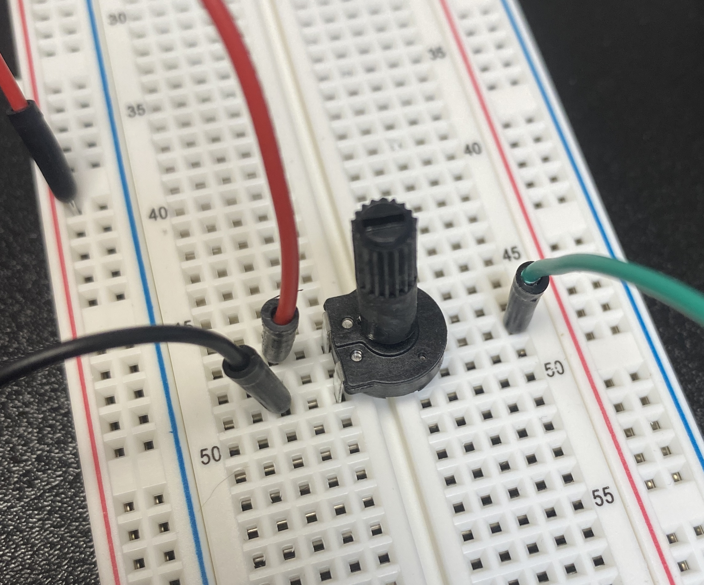
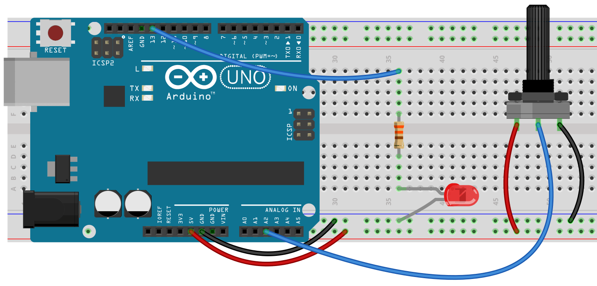

# Chapter 6.3 - ANALOG READ AND THE POTENTIOMETER
A potentiometer is a variable resistor. By twisting the knob we can change the value of resistance. For more on the inner workings of a variable resistor check out [this description](https://www.bcae1.com/potentio.htm), or watch this video:

[](https://youtu.be/gGzP_4_LPjY)

Here’s the Analog Input sketch from the Examples in the Sketchbook. For this circuit you need an LED in pin 13 (as we’ve done before) and a potentiometer (any size) in analog pin 2. To wire up the potentiometer you connect the center lead to analog pin 2. The two sides get hooked to power. One side goes to positive volts and the other goes to the ground. 




```
int sensorPin = A2;    
int ledPin = 13;
int sensorValue = 0;

void setup() {
  // declare the ledPin as an OUTPUT:

}

void loop() {
  sensorValue = analogRead(sensorPin);
  
  // turn the ledPin on
 
  delay(sensorValue);

  // turn the ledPin off:

  delay(sensorValue);
}
```
By adjusting the potentiometer you should be adjusting the blink rate of your LED. Notice we do not need to do pinMode for the potPin. All analog pins are inputs. If we want an analog output we need to use one of the digital PWM pins.

Now lets use the potentiometer as a light dimmer. We’re going to leave the potentiometer in pin two, but we’re moving the LED to pin 11, which is a PWM pin. The easiest thing would be to read the potPin and use that as the val in analogWrite(ledPin, val), but this will not work. analogRead will return a value between 0 and 1023, while analogWrite wants a value between 0 and 255. To do this we’re going to use a new command. The map command will work for this.
```
val = map(val, 0, 1023, 0, 255);
```
**map** has five arguments:
1. Number we want to change
2. Minimum value we could have
3. Maximum value we could have
4. Minimum value we want
5. Maximum value we want
```
int sensorPin = A2;    
int ledPin = 11;
int sensorValue = 0;
int val = 0;

void setup() {
  // declare the ledPin as an OUTPUT:

}

void loop() {
  sensorValue = analogRead(sensorPin);
  val = map(sensorValue, 0, 1023, 0, 255);
  // Write the mapped value to your LED
}
```
