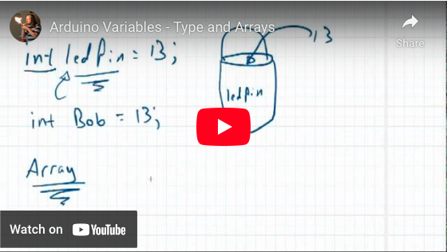

# CHAPTER 6.2 - ARRAYS
[](https://youtu.be/Br8h5r_yqJQ)

The code below will sequence the fading LEDs one after the next. It uses for loops inside of another for loop. In this case the array is named “woot”. This could be any word, just like other variable names.
```
/*
 * This code was orginally written by two
 * DCHS students, Dan Joyce and Lauren Stec
 * They wanted to sequence only the fading
 * LEDs.
 */

int woot[] = {3, 5, 6, 9, 10, 11};

void setup() {
  // notheing to see here, move along
}

void loop() {
  for(int x = 0; x <= 5; x++){

    for(int value = 0; value <= 255; value+=5) {
      analogWrite(woot[x], value);
      delay(30);
    }

    for(int value = 255; value >= 0; value-=5) {
      analogWrite(woot[x], value);
      delay(30);
    }
    
  }
  
}
```
###Time to Play:
- Incorporate a push button in some way.
- Change it so that the next LED is starting to get brighter while the current one is getting dimmer
