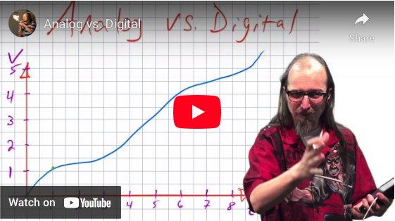

# CHAPTER 6 – ANALOG DATA AND SENSORS
So far we’ve only been dealing with digital data. We have on or off, pressed or not pressed. In this chapter we will begin looking analog data. We will be able to be partially on rather than fully on. Watch this video:

## Work through the following:
- Introduction to Fading LEDs
- Use Arrays to sequence the Fading Pins
- Analog Read and the Potentiometer
- Have you seen the light?
