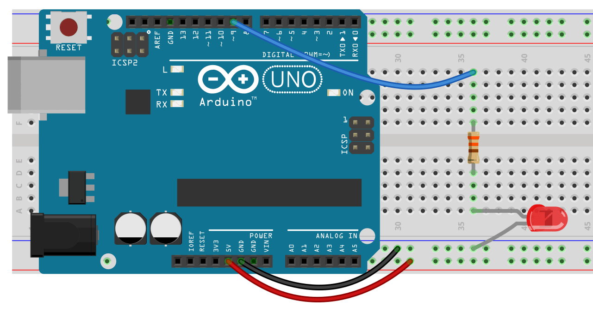
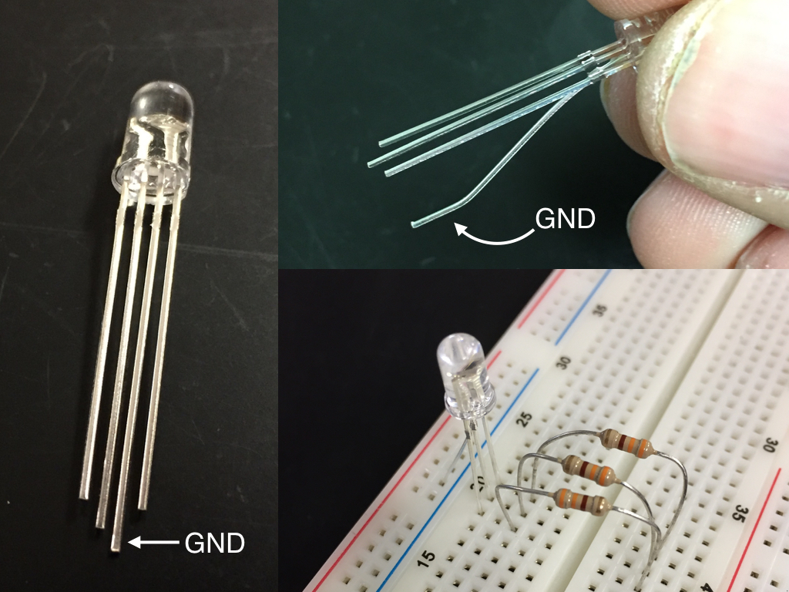

# CHAPTER 6.1 - FADING LEDS
[](https://youtu.be/dn26xGw4GLQ)



PWM stands for Pulse Width Modulation. We can use this to simulate an analog output. This is not really an analog output, but a digital approximation of analog. Basically it sends signals of varying lengths causing our led to be on and off for varying lengths of time… What the heck is that supposed to mean? Basically we flash an LED very fast, so fast we can’t tell it’s flashing. The more time that is spent “off” the dimmer it will appear to our eyes. Not all pins are capable of PWM. The pins that are, are marked with either a ~ or PWM and are pins: 3, 5, 6, 9, 10, 11.

PWM can have values ranging from 0 – 255 (256 possible states). When set to zero the led will be off, when set to 255 the LED will be at its brightest. If you put in a number higher than 255 the Arduino will still use it, however it will not be brighter. Basically it will “wrap”, so 256 will be interpreted as 0 and the LED will be off, 267 will behave the same as 10 and so on.

In the sketch below, you can see a for loop. It starts at zero and increases to 255 in increments of 5.
fadeValue+=5 means fadeValue=fadeValue+5 (it’s the lazy way of writing it).
```
int ledPin = 9;

void setup() {
  // pinMode is not needed for Analog Write

}

void loop() {
  for(int fadeValue = 0; fadeValue <= 255; fadeValue += 5) {
    analogWrite(ledPin, fadeValue);
    delay(30);
  }

  for(int fadeValue = 255; fadeValue >= 0; fadeValue -= 5) {
    analogWrite(ledPin, fadeValue);
    delay(30);
  }
}
```
We have one new command in this Sketch:
```
analogWrite(ledPin, fadeValue);
```
analogWrite has two arguments. The first is a pin number that corresponds to one of the PWM pins. The second is a number between 0 and 255. This does not have to be in a for loop. You can, for example flash your LED at a lower brightness by using code like:
```
analogWrite(ledPin, 180);
  delay(500);
  analogWrite(ledPin, 0);
  delay(500);
  ```
In this case analogWrite(ledPin, 0) is equivalent to writing digitalWrite(ledPin, LOW).

Here’s another version of the fading LED that does not involve using a for loop. In this case we are using if.
```
int brightness = 0;
int fadeAmount = 5;

void setup() {
}

void loop() {
  analogWrite(9, brightness);
  brightness = brightness + fadeAmount;
  delay(30);

  if(brightness == 0 || brightness == 255) {
    fadeAmount = fadeAmount * -1;
  }
}
```
Can you explain how this code works?

### Additional Tasks:
- I’ve given you versions of pulsing LEDs that use for and if. Can you use while to do the same thing?
- Find two different ways to change the fading speed.
- Fade multiple LEDs
- Make the fading respond to a push button – Make the LED fade up to full and stay on when the button is pressed and fade down to nothing and stay off when not pressed.

### One more Thing: Color Mixing
For a little fun go into the Black Case labeled “Special Components” and find an RGB LED. These are LEDs with four legs.



These are really three LEDs in one: red, green, and blue (hence the RGB). The longest lead is the negative (GND). I recommend bending the GND lead slightly and then putting it in the breadboard as shown. Since this is three LEDs you will need three resistors.

By combining different amounts of red, green, and blue you can make any color you want. Try it below and then use your Arduino and an RGB LED to make a cool light show by fading from one color into another. You might want to make a [paper cube](http://www.highschoolmaker.com/physics/led-color-mixer-make-and-take/) to defuse the light more.
