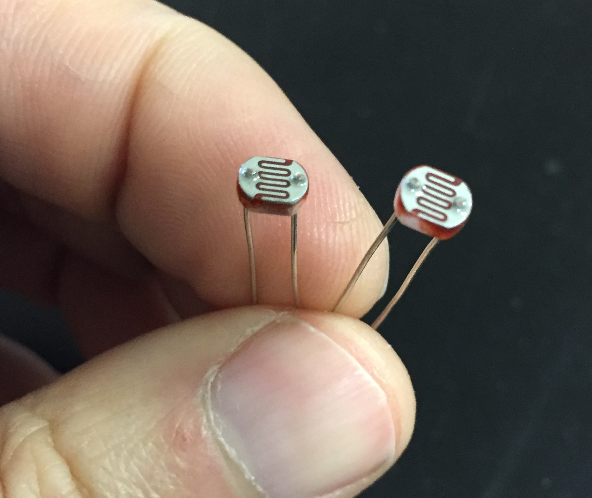
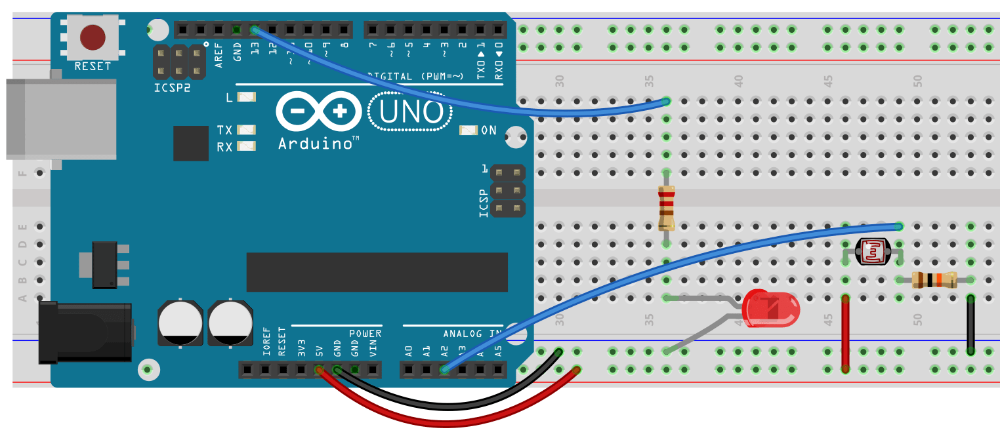

# Chapter 6.4 – ANALOG READ AND A PHOTORESISTOR
This is where we can add other cool sensors to our Arduino. Remember analogRead is really a voltage comparator. This means that we will actually be comparing two resistors to each other and will be able to determine exactly how different they are. This is not so interesting if we have two fixed resistors, but becomes cool when we have one fixed and one variable resistor. So far, the only variable resistors we’ve used are potentiometers.

Photresistors change value depending on light level, while thermistors change based on temperature. Both can be used in the same way. The circuit to the right shows the circuit diagram you could use with either of these. You’ll notice that there is a variable resistor and a fixed resistor both hooked up to your analog pin. For a fixed resistor try 10k ohms. You can find photoresists in the Black Case labeled “Sensors”.



The circuit below is virtually the same one we used for the potentiometer circuit. Again, we need an LED in digital pin 13. Set up the Arduino with the circuit and the program and answer the questions below.


```
int sensorPin = A2;    
int ledPin = 13;
int sensorValue = 0;

void setup() {
 

}

void loop() {
  sensorValue = analogRead(sensorPin);
  
  // turn the ledPin on
 
  delay(sensorValue);

  // turn the ledPin off:

  delay(sensorValue);
}
```

### Try the code above:
- Does it work the same as the potentiometer?
- Change the 10k ohm resistor for a 1-2k ohm resostor. Do you notice any differences?

What you should notice is that neither the 10k nor the 1k resistors will give you the same range of flash rates as the potentiomemter. How can we make it respond the same? Use your Serial Monitor to see what sort of values you can get (you’ll, of course, need to add the code for that first). Then use the map() function to adjust it to give you a wider range of values.

### Time to Play
- Reverse it. For example, if your circuit flashed faster as it got dark change your code so that it flashes faster as it gets dark.
- Use your photoresistor to make your LED get brighter as the room gets darker. It should be full brightness when the room is dark and completely off when the room is light.
