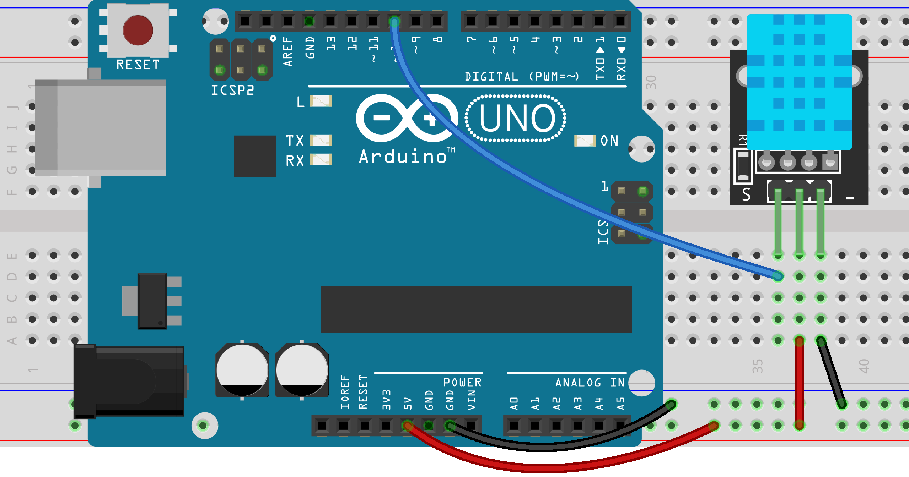

```
/*!
 * @file readDHT11.ino
 * @brief DHT11 is used to read the temperature and humidity of the current environment. 
 *
 * @copyright   Copyright (c) 2010 DFRobot Co.Ltd (http://www.dfrobot.com)
 * @license     The MIT License (MIT)
 * @author [Wuxiao](xiao.wu@dfrobot.com)
 * @version  V1.0
 * @date  2018-09-14
 * @url https://github.com/DFRobot/DFRobot_DHT11
 */

#include <DFRobot_DHT11.h>
DFRobot_DHT11 DHT;
#define DHT11_PIN 10
int temp;

void setup(){
  Serial.begin(115200);
}

void loop(){
  DHT.read(DHT11_PIN);
  temp = DHT.temperature;
  temp = temp*9/5+32;
  Serial.print("temp:");
  Serial.print(temp);
  Serial.print("  humi:");
  Serial.println(DHT.humidity);
  delay(1000);
}
```
