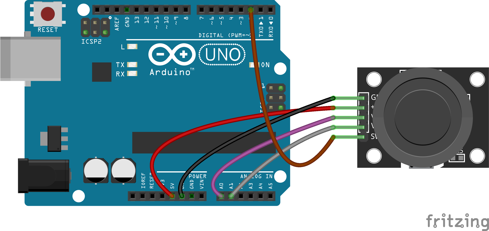

# The Joy Stick Module


```
const int xPin = A0;
const int yPin = A1;
const int buttonPin = 2;

void setup() {
  // Set up your switch pin
  pinMode(buttonPin, INPUT);
  digitalWrite(buttonPin, HIGH);

  Serial.begin(9600);

}

void loop() {
  // Read your sensors and print values:
  Serial.print("xVal = ");
  Serial.print(analogRead(xPin));
  Serial.print(" yVal = ");
  Serial.print(analogRead(yPin));
  Serial.print(" Button = ");
  Serial.println(digitalRead(buttonPin));
  // Note HIGH or 1 means not pressed for the button
 
  delay(20);
}
```
