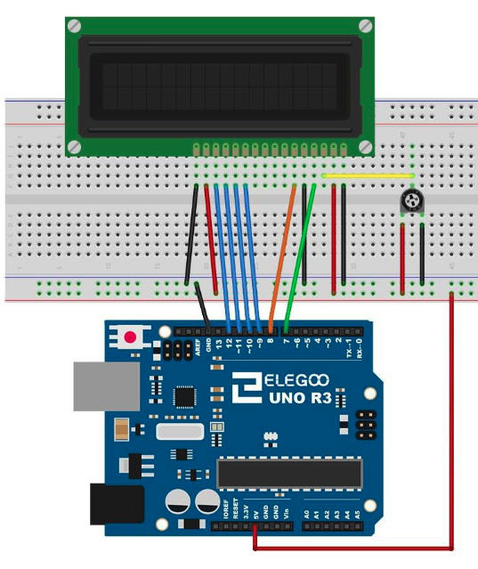
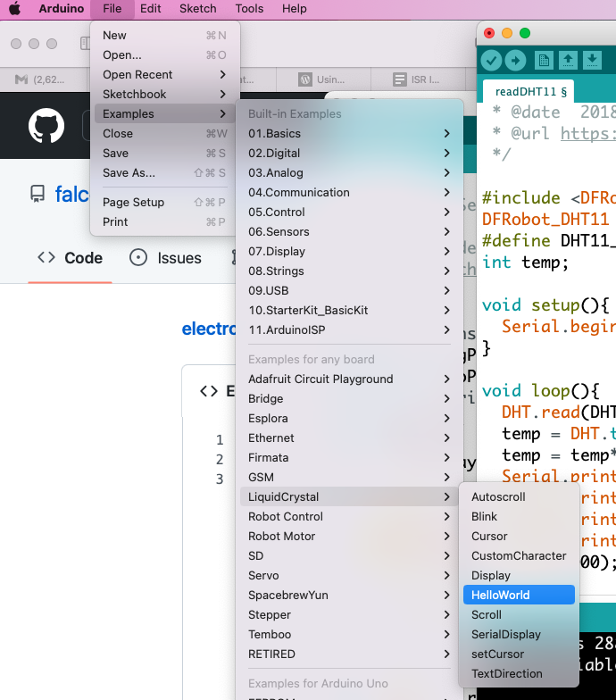

# Using your LCD with Arduino

The Library you need for your LCD is included with Arduino. You should open File - Examples - LiquidCrystal - HelloWorld

Try some of the other example sketches to see how this works. Once you are done see oif you can use the LCD to dsiplay other stuff:
- Hook up the [DHT11](dht11.md) and display the temperature and humidity
- Attach your [Ultrasonic range finder](ultrasonic_range.md) and display the distance away.
- Hook up some buttons and make a simple game
