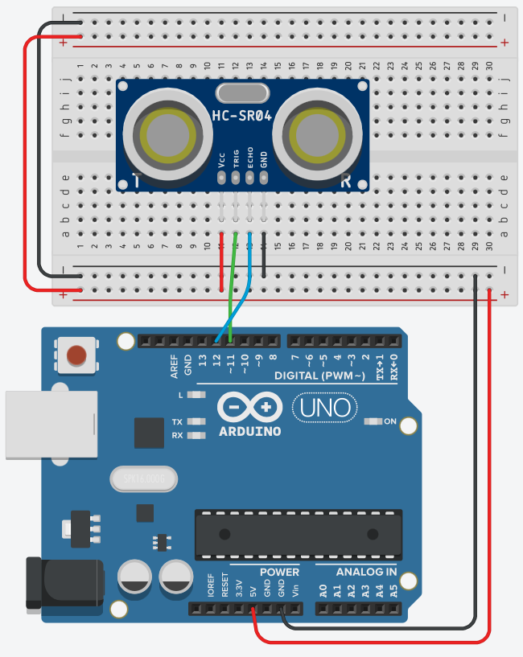

# Ultrasonic Range Finder
This sensor sends out ultrasound waves and then listens for a reflection to return to the sensor. Basically this is a sonar. By timing how long it takes for the sound to return, the distance to an object can be caluclated. The code below assumes the speed of sound is 340 m/s. It should be noted that the speed of sound will vary slightly based on the temparature and atmospheric pressure. So unless you account for this you will not be able to be precise.



```
// defines pins numbers
const int trigPin = 11;
const int echoPin = 12;


void setup() {
  pinMode(trigPin, OUTPUT); // Sets the trigPin as an Output
  pinMode(echoPin, INPUT); // Sets the echoPin as an Input
  Serial.begin(9600); // Starts the serial communication
}

void loop() { 
  Serial.print("Distance: ");
  Serial.println(readSensor());  
  delay(10);
}


int readSensor(){
  // defines variables
  long duration;
  int distance;
  
  // Clears the trigPin
  digitalWrite(trigPin, LOW);
  delayMicroseconds(2);
  
  // Sets the trigPin on HIGH state for 10 micro seconds
  digitalWrite(trigPin, HIGH);
  delayMicroseconds(10);
  digitalWrite(trigPin, LOW);
  
  // Reads the echoPin, returns the sound wave travel time in microseconds
  duration = pulseIn(echoPin, HIGH);
  
  // Calculating the distance in cm
  distance = duration * 0.034 / 2;
  
  return distance;
  
 }
 ```
## Play and Learn
- What is the maximum range?
- Is there a minimum range?
- How precise is it?
- Will multiple sensors interfere with each other?
- How small can your target be?
- How well do you need to aim? (i.e. is it like a laser pointer or is it bigger than that)
